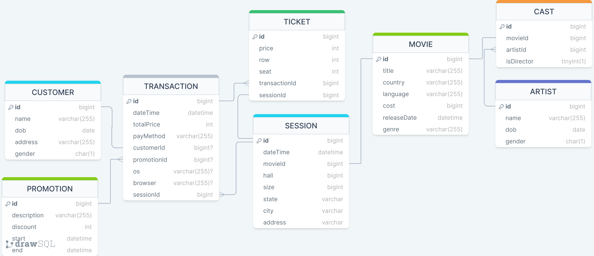

# CineDataQuest

CineDataQuest is my ticket to cinematic data analysis. With over 3 million entries, delve into ticket sales, movie preferences, and more as I showcase my SQL skills in this practice portfolio project. Lights, camera, data!

## Conceptual Design

### ROLAP Schema

### Assumptions

- The central focus of the data model is the "Transaction" entity, which serves as the primary event for creating a fact table. (Snowflake schema)
- Online transactions must have a non-null value for OS and browser.
- We assume that when customers conduct an offline transaction, they are buying tickets for sessions in the respective theater. Customers will not purchase tickets for sessions in Theater A while physically present at Theater B.
- Ticket prices are assumed to be integer values.
- Promotion discounts are assumed to be integer values.
- Gender in all tables is represented by a single character:
  - Male - M, Female - F, Unknown - U.
- Datetime values in all tables are assumed to be non-null.
- The database is assumed to be constructed with SQLite.

## Data Scale

With over 3 million entries, CineDataQuest boasts an extensive dataset that provides ample opportunities for in-depth analysis and exploration. This substantial volume of data ensures robust insights and comprehensive examinations into various aspects of cinema operations and customer behaviors.
